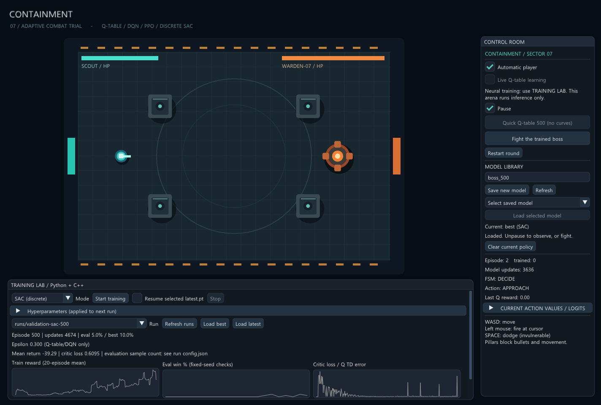

# CONTAINMENT / Sector 07

Lab 안에서 실행하는 C++/DirectX 11 탑뷰 보스 전투 실험이다. 격리 시설의 청록색 정찰병과 주황색 보안 로봇 WARDEN-07이 싸운다. 외부 이미지 없이 도형으로 맵, 캐릭터, 탄환, 공격 예고를 그린다.

## 실행

Visual Studio 2026 Community의 C++ 데스크톱 개발 도구와 Windows SDK, v145 도구 집합이 필요하다. Python 학습에는 Python 3.12, uv와 CPU PyTorch/NumPy를 사용한다. 프로젝트 전용 `.venv`에 설치하며 GPU는 필요하지 않다.

1. `build.cmd`를 실행한다. 게임 EXE와 Python이 호출할 `ArenaTraining.dll`을 함께 만든다. Visual Studio 솔루션만 빌드하면 EXE만 생성하므로 첫 설정 시에는 이 스크립트를 사용한다.
2. 처음 한 번 `setup-training.cmd`를 실행해 Python 의존성을 설치한다.
3. `run.cmd`로 게임을 실행한다. 출력은 `build/Release/Containment.exe`다.
4. 아래 `TRAINING LAB`의 Mode에서 Q-table/DQN/PPO/SAC를 선택한다.
5. `Hyperparameters`에서 설정한 뒤 `Start training`을 누른다. 별도 Python 프로세스가 같은 C++ 전투 코드로 자동 대전을 수행한다. 화면의 전투는 별도의 관전/수동 플레이용이다.
6. `Load best` 또는 `Load latest`로 학습된 모델을 현재 게임에 적용한다. 불러오면 일시정지한다. `Pause`를 풀어 관전하거나 `Fight the trained boss`로 직접 싸운다.

`Stop`은 현재 에피소드/평가를 끝내고 체크포인트를 저장한 뒤 종료한다. 게임 창을 닫으면 학습 프로세스도 종료하므로 최신 결과까지 보존하려면 먼저 Stop 완료를 기다린다. 이미 저장된 체크포인트는 유지된다.



WASD 이동, 마우스 왼쪽 버튼 사격, Space 무적 회피. 기둥은 이동과 탄환을 막는다. 한 판은 최대 35초이며 일반 관전/수동 전투가 끝나면 `Restart round`로 재시작한다.

## 모델 저장과 이어서 학습

오른쪽 `MODEL LIBRARY`는 이름별 실행용 스냅샷을 관리한다. `run.cmd`로 실행하면 아래 경로는 이 실험 폴더 기준이다.

1. 이름 칸에 `boss_500`처럼 영문/숫자/하이픈/밑줄 1~64자를 입력한다.
2. `Save new model`을 누르면 Q-table은 `models/boss_500.qtable`, 신경망은 `models/boss_500.nn`에 저장한다. 같은 이름은 덮어쓰지 않는다.
3. 목록에서 모델을 선택하고 `Load selected model`을 누른다. 외부에서 파일을 추가했다면 `Refresh`를 누른다.
4. 불러오기에 성공하면 현재 라운드를 초기화하고 실시간 학습 OFF/일시정지 상태로 전환한다. 별도 Python 학습 프로세스는 계속 진행되며 Stop으로 중지한다.

Python 학습은 실행마다 별도의 `runs/날짜-시간-알고리즘/` 폴더를 만든다.

| 파일 | 용도 |
|---|---|
| `config.json` | 해당 실행의 알고리즘과 하이퍼파라미터 |
| `metrics.tsv` | 에피소드 보상, 평가 결과, 손실, 엔트로피, KL, 탐색률, 갱신 횟수 |
| `best.pt`, `latest.pt` | 학습용 네트워크/타깃/옵티마이저 상태, 설정, 갱신 횟수 |
| `best.nn`, `latest.nn` | 신경망의 C++ 실행용 가중치. Q-table은 `.qtable` |
| `best.json`, `finished.json` | 최고 평가 시점과 실행 종료 결과 |
| `console.log`, `error.txt` | GUI 실행 로그와 실패 시 오류 |

Run 목록에서 이전 실행을 선택하고 `Resume selected latest.pt`를 체크하면 선택한 실행의 **최신 체크포인트**에서 새 실행으로 이어간다. 알고리즘이 다르면 거부하며 UI의 현재 학습률/설정을 적용한다. replay buffer, 진행 중인 PPO rollout, 난수 상태와 전투 상태는 재수집하므로 비트 단위의 완전한 재개는 아니다. `.nn` 이름별 저장은 실행용 가중치만 포함하므로 재학습에는 `runs/`의 `.pt`를 사용한다. 최고 체크포인트부터 재학습하려면 CLI `--resume 경로/best.pt`를 사용한다.

기존 `policy.qtable`도 목록에 표시한다. 실패한 불러오기는 현재 정책을 유지한다. `.venv`, `models`, `runs`, 빌드 산출물은 Git에 포함하지 않는다.

## 곡선 읽기

- Train reward: 학습 에피소드의 보상 20판 이동평균. 탐색 행동이 포함된다.
- Eval win: 고정된 별도 시드 상대에서 탐색과 갱신을 끈 승률. X축은 평가 체크포인트 순서다.
- Critic loss: DQN의 Huber 손실, PPO의 가치 함수 손실, SAC의 두 Q 함수 MSE 합. Q-table은 TD 오차 제곱이다. 알고리즘 간 숫자 크기를 성능 순위로 비교하지 않는다.
- More curves: 원래 에피소드 보상, 평가 보상, actor 손실, 정책 엔트로피를 확인한다. 각 그래프의 값은 마우스를 올려 확인한다.
- Early stop checks: 최고 평가가 개선되지 않은 평가 횟수로 중단한다. 기본 0은 비활성이다.

`best`는 평가 승률 우선, 동률이면 평균 보상이 높은 모델이다. `latest`와 별도로 저장하며 학습 전 모델도 평가 후보에 포함한다. 평가가 최고보다 5%p 넘게 낮아지면 주의 문구를 표시한다. 작은 표본의 등락만으로 퇴화를 확정하지 않는다. 평가 시드로 모델을 선택했으므로 이 곡선은 최종 미사용 테스트가 아닌 validation이다. 마지막 점검에는 별도의 시드를 쓰는 `training/evaluate.py`를 사용한다.

## 학습 모드와 설정

| 모드 | 구현 | 주요 설정 |
|---|---|---|
| Q-table | 96상태 × 6행동의 Q 갱신 | Q learning rate, epsilon |
| DQN | 24→64→64→6 ReLU MLP, 50,000 전이 replay, 타깃 네트워크, Huber 손실, soft target update | NN learning rate, batch, epsilon/감소 |
| PPO | categorical actor, 별도 value MLP, GAE, clipped surrogate, 4 epoch, KL 제한 | rollout, clip, GAE lambda, entropy |
| SAC (discrete) | categorical actor, twin Q/target, 행동 확률의 정확한 기대값, 고정 alpha | batch, SAC alpha |

모두 동일한 접근/선회/근접/돌진/충격파/부채꼴 6행동을 선택하고 FSM이 실행한다. **SAC는 연속 이동 제어가 아닌 이산 행동 버전**이다. 기본값은 신경망 Adam 학습률 0.0003, batch 64, PPO rollout 256, clip 0.2, GAE lambda 0.95, entropy 0.01, SAC alpha 0.2다. gamma는 초당 0.96이며 행동 경과 시간만큼 거듭제곱한다. Q-table/DQN 탐색률은 0.3부터 에피소드당 0.995배 감소, 최소 0.05다. PPO/SAC는 epsilon을 쓰지 않는다.

신경망 관측은 위치/상대 위치와 거리, 체력, 스킬/회피/사격 쿨다운, 경과 시간, 가장 가까운 플레이어 탄환의 상대 위치/속도, 탄환 수, 기둥까지 거리 등 정규화된 24개 값이다. Q-table과 관측 표현이 다르므로 전체 알고리즘의 성능 순위를 단정하는 실험은 아니다.

## 전투와 학습

- 맵: 격자 바닥, 엄폐 기둥 4개, 격리문, 경고선.
- 플레이어: 조준 사격과 회피를 사용하는 정찰병.
- 보스: 기본 근접 공격, 직선 돌진, 원형 충격파, 부채꼴 7발 사격.
- Q-table 행동: 접근, 선회, 기본 공격, 돌진, 충격파, 부채꼴 사격.
- FSM 실행: 선택 → 예고 → 실행 → 후딜 → 선택. Q-table은 행동을 고르고 FSM은 공격 타이밍과 판정을 수행한다.
- 관측: 거리 3단계 × 보스 체력 2단계 × 플레이어 체력 2단계 × 스킬 쿨다운 조합 8개 = 96상태. 행동은 6개다.
- 쿨다운 중인 스킬은 행동 선택과 다음 상태의 최대 Q 계산에서 제외한다.
- 보상: 플레이어 피해량 × 0.12, 보스 피해량 × -0.1, 초당 -0.008, 승리 +20, 패배 -20.
- 게임 안의 Live Q-table learning/Quick Q-table은 이전의 간단한 C++ 학습 경로이며 기본 학습률 0.16, 탐색률 0.18이다. 이 경로에는 그래프가 없으므로 비교 실험에는 TRAINING LAB의 Q-table 모드를 사용한다.
- 학습과 실제 플레이는 같은 60Hz 전투 코드를 사용한다. 학습 step은 한 FSM 행동이 끝날 때까지의 전이다. 평가에서는 탐색과 갱신을 끈다. Python/C++ 신경망 추론은 마스크된 argmax를 사용한다. 기존 C++ Q-table은 최대값 동률을 무작위로 선택하므로 Python Q-table의 첫 argmax와 동률 처리 방식이 다르다.

## 기존 엔진 연결 범위

형제 실험 `dx11-wboit-benchmark`의 `Engine::GameObject`, `InputManager`, `DebugUiManager`와 번들 ImGui를 직접 참조한다. 플레이어와 보스는 GameObject 파생 객체다. 기존 엔진 소스는 복사하거나 수정하지 않는다.

창과 DirectX 11 장치 호스트는 이 실험 전용이며 2D 그림은 ImGui draw list로 그린다. 기존 3D 렌더러 전체나 Sweeper 프로젝트에 통합한 것은 아니다.

## 검증 명령

이 디렉터리에서 실행한다.

```powershell
.\build\Release\Containment.exe --test
.\.venv\Scripts\python.exe training\test_training.py
.\.venv\Scripts\python.exe training\train.py --mode DQN --episodes 500 --run runs\my-dqn
.\.venv\Scripts\python.exe training\evaluate.py runs\my-dqn\best.pt --games 100
.\build\Release\Containment.exe --eval-model runs\my-dqn\best.nn 100 2000000
.\build\Release\Containment.exe --trainer-smoke PPO
.\build\Release\Containment.exe --smoke
```

Python 테스트는 알고리즘별 갱신, 행동 마스크, 종료 bootstrap, 모델 저장/복원, C++ 추론 수치와 실제 전투 결과의 일치, 평가 격리, Stop/Resume을 확인한다. `--trainer-smoke`는 ImGui에서 사용하는 실행 경로로 Python을 띄워 짧게 학습하고 종료를 확인한다. `--smoke`는 숨긴 창에서 DX11 60프레임을 렌더링하고 `build/preview.bmp`를 저장한다.

기존 `--train N`/`--eval`은 단일 `policy.qtable`을 쓰는 이전 C++ CLI다. `--train`은 그 파일을 교체하므로 새 실험에는 이름별 run을 만드는 Python CLI를 권장한다. 실제 수행 결과는 [검증 기록](docs/VALIDATION.md)을 참고한다.

## 현재 한계

게임과 학습 파이프라인을 확인하는 프로토타입이며 강한 보스 정책의 수렴을 보장하지 않는다. 상대는 한 종류의 규칙 기반 봇이고 다양한 사람에게 일반화됐다는 증거는 없다. 지연된 탄환 보상은 현재 행동에 귀속되며, 모든 탄환과 봇의 내부 상태를 관측하지 않으므로 부분 관측 문제도 남는다. 35초는 이 실험의 유한 에피소드 종료이며 bootstrap을 하지 않는다.

신경망은 Python에서 규칙 봇 상대 학습, C++ 게임에서는 추론만 지원한다. 사람과 싸우며 실시간 신경망 학습하는 기능은 없다. 실행용 신경망은 고정된 작은 MLP를 직접 추론하며 ONNX/임의 구조 모델 호환 기능은 아니다. 수동 키 입력의 실제 플레이 테스트는 별도로 필요하다.

## 구현 참고

- [PyTorch DQN 튜토리얼](https://docs.pytorch.org/tutorials/intermediate/reinforcement_q_learning.html): replay, target network.
- [PPO-Clip 설명](https://spinningup.openai.com/en/latest/algorithms/ppo.html): clipped objective, GAE 기반 actor/value 학습.
- [Discrete SAC 논문](https://arxiv.org/abs/1910.07207): 이산 행동의 엔트로피 정규화 정책과 Q 기대값.
