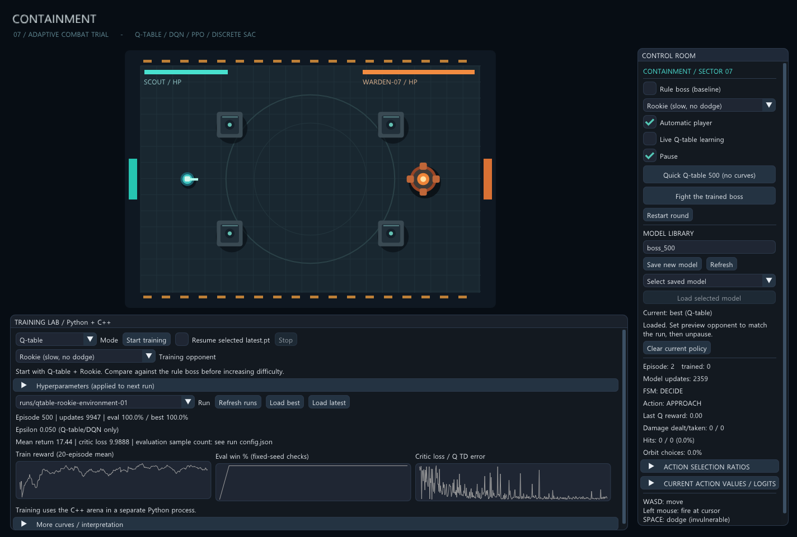

# 강화학습 연결 검증, 2026-09-09

## Q-table 중심 환경 검증 추가

환경 추가 커밋 `211715b`, seed 3000000부터 상대별 100판, 탐색 없는 평가 결과다. 아래 Kiter 수치는 난수 반응 지연 추가 **이전** 환경이다.

| 상대 | 규칙 보스 승리 | Rookie 학습 Q-table best 승리 |
|---|---:|---:|
| Target | 100/100 | 100/100 |
| Rookie | 100/100 | 100/100 |
| Rusher | 100/100 | 48/100 |
| Kiter (변경 전) | 39/100 | 1/100 |
| Legacy | 7/100 | 0/100 |

Q-table은 seed 42, Rookie 상대 500 에피소드 학습, 25판마다 validation 20판을 사용했다. 총 9947회 갱신했고 best는 100 에피소드에서 선택됐다. Rookie 평가 평균 받은 피해는 Q-table 133.55, 규칙 보스 111.8이다. 쉬운 상대의 승률 100%는 다른 상대 일반화나 기준 보스보다 좋은 효율을 뜻하지 않는다. 여러 학습 seed 검증은 남아 있다.

이 단계에서 Release EXE/DLL 빌드, Python 테스트 9개, C++ 테스트를 통과했다. `--smoke`로 실제 DX11 프레임도 생성했다. 아래 기존 8개 테스트와 신경망 결과는 앞선 검증 기록이다.

실험 고찰 원문: [REFLECTION_DISCUSSION.md](REFLECTION_DISCUSSION.md). 모델과 실행 로그는 로컬 `runs/qtable-rookie-environment-01`에 보관하며 Git에는 포함하지 않는다.

## 실행 환경과 통과 항목

### 후속: 거리 유지 봇의 불완전한 판단

Kiter에 170~250 목표 거리 오차와 0.25~0.55초 판단 유지 시간을 추가했다. 난수 엔진은 보스 탐색과 분리하고 시드 재설정 시 함께 초기화한다. 첫 비교에서는 기준 보스 승률이 39/100에서 22/100으로 오히려 낮아졌다. 이동 속도를 플레이어의 85%에서 70%로 낮춘 최종 조건에서는 41/100이었다. 같은 100개 평가 시드를 사용했으며, 39%와 41% 차이만으로 유의미한 난도 하락을 단정하지 않는다. 다른 네 상대의 기준 결과는 그대로 유지됐다.

최종 Release EXE/DLL 빌드, Python 테스트 10개와 C++ 테스트 통과. 새 테스트는 같은 seed에서 Kiter 전투 경로 재현과 다른 seed에서 경로 차이를 확인한다. 변경된 Kiter 상대의 Q-table 재학습은 아직 수행하지 않았다. 위 Q-table 교차 평가 표는 변경 전 환경 결과다.

- Windows x64, Visual Studio v145 Release 빌드. 게임 EXE와 ArenaTraining.dll 생성.
- Python 3.12, CPU PyTorch 2.14.0+cpu, NumPy 2.5.2.
- 기존 C++ `--test`: 모델별 저장/전환, 중복 방지, Q 갱신과 행동 마스크, 종료, 평가 동결 검사 통과.
- Python unittest 8개 통과. 네 알고리즘의 실제 파라미터 갱신, DQN 종료 bootstrap, 마스킹/유한 gradient, 저장/복원, PPO 재개, Stop, 평가 난수 격리 확인.
- DQN/PPO/SAC 가중치 export를 C++ forward와 2e-5 상대/절대 허용오차로 대조. 동일 모델/시드의 C++ EXE와 Python 환경 전투 결과도 대조.
- QTABLE/DQN/PPO/SAC 각각 `--trainer-smoke` 통과. 숨긴 DX11 창에서 실제 패널 실행 경로로 Python 생성, 학습, 정상 종료 확인. 물리적인 마우스 클릭 자동화 테스트는 아님.
- DX11 실제 프레임 캡처를 확인하고 README에 첨부.

## 500 에피소드 실행

학습 seed 42, 25판마다 고정 validation 시드 1000000부터 20판 평가. 기본 하이퍼파라미터 사용. 평가 중 탐색과 학습을 끄고, 승률 우선/보상 동률 비교로 최고 모델을 선택했다.

| 모드 | 학습 업데이트 수 | 최고 validation 승률 | 마지막 validation 승률 |
|---|---:|---:|---:|
| DQN | 5430 | 1/20 (5%) | 1/20 (5%) |
| PPO | 1324 | 0/20 (0%) | 0/20 (0%) |
| SAC (discrete) | 4674 | 2/20 (10%) | 1/20 (5%) |

알고리즘마다 업데이트의 의미가 다르므로 횟수를 직접 비교하지 않는다. 소규모 단일 봇 실험이며 모델의 수렴이나 알고리즘의 우열을 증명하지 않는다.

SAC 최고 체크포인트는 375 에피소드였다. 모델 선택에 사용하지 않은 시드 2000000부터 100판으로 다시 평가했다.

| SAC 체크포인트 | 승리 | 패배 | 시간 종료 | 평균 보상 | 승률 Wilson 95% 구간 |
|---|---:|---:|---:|---:|---|
| best (375판) | 15 | 85 | 0 | -33.9394 | 9.31~23.28% |
| latest (500판) | 2 | 96 | 2 | -40.7744 | 0.55~7.00% |

이번 실행에서는 더 오래 학습한 최신 정책이 중간 정책보다 나빴다. 원인을 과적합 또는 특정 최적화 문제로 단정하지 않는다. loss 감소 자체도 전투 성능 향상을 뜻하지 않는다. 최고 모델 별도 보관과 탐색 없는 평가 곡선이 필요한 이유를 보여주는 한 사례다.

## 남은 검증

- 여러 학습 seed와 다양한 상대 봇, 실제 플레이어 일반화 평가.
- 실제 키보드/마우스로 장시간 플레이, 창 크기별 UI 사용성 확인.
- 장시간 실행의 성능/디스크 크기와 강제 종료 복구 점검.
- 신경망 실시간 사람 상대 학습은 현재 구현 범위 밖이다.

실행 데이터와 모델은 로컬 `runs/validation-*-500`에 있으며 Git에는 포함하지 않는다.
